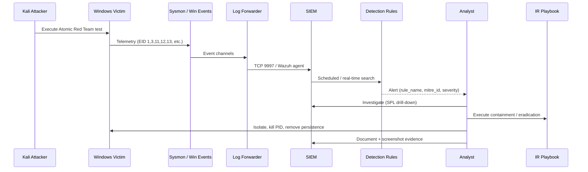

# Attack → Detect → Respond Workflow

End-to-end flow for each kill-chain stage in the Home SOC lab.



## Stage workflows

### 1. Initial Access

| Phase | Action |
|-------|--------|
| **Attack** | Deliver payload (`attacks/initial-access.md`) — T1204.002 / T1566.001 |
| **Detect** | DET-IA-001/002 — process from Downloads, file create + execute |
| **Respond** | Isolate host → quarantine file → reset `labuser` → hunt hashes |

```
[Kali] --HTTP/SMB--> [Victim: user executes payload]
                         |
                         v
                   Sysmon 11, 1
                         |
                         v
                   SIEM: DET-IA-001 fires (High)
                         |
                         v
                   IR: firewall block 192.168.56.20, logoff user
```

### 2. Execution

| Phase | Action |
|-------|--------|
| **Attack** | `Invoke-AtomicTest T1059.001` — encoded PowerShell |
| **Detect** | DET-EX-001 — `-EncodedCommand` in CommandLine |
| **Respond** | Kill process tree → clear TEMP → hunt persistence |

### 3. Persistence

| Phase | Action |
|-------|--------|
| **Attack** | Run key / scheduled task — T1547.001, T1053.005 |
| **Detect** | DET-PE-001/002 — registry + Event 4698 |
| **Respond** | Remove Run key / delete task → reboot → service audit |

### 4. Privilege Escalation

| Phase | Action |
|-------|--------|
| **Attack** | UAC bypass Atomic — T1548.002 |
| **Detect** | DET-PR-002 — fodhelper/sdclt patterns + 4672 |
| **Respond** | Revoke admin session → disable `labadmin` → patch / UAC harden |

### 5. Exfiltration

| Phase | Action |
|-------|--------|
| **Attack** | POST staging file to Kali:8080 — T1041 / T1048.003 |
| **Detect** | DET-EXF-001/002 — Sysmon 3 to 192.168.56.20 |
| **Respond** | Block egress → preserve staging copy → scope + snapshot restore |

## Operating rhythm (lab session)

1. **Snapshot** victim VM (`pre-stage-<name>`).
2. **Baseline** SIEM search — confirm no existing alerts for rule.
3. **Execute** one Atomic test from `attacks/`.
4. **Wait** 1–5 min (forwarder + search schedule).
5. **Triage** alert in dashboard → pivot on `host`, `User`, `CommandLine`.
6. **Respond** using `response/incident-response.md`.
7. **Capture** screenshot → `screenshots/`.
8. **Cleanup** or revert snapshot.
9. **Update** `attack-mapping.csv` notes if tuning changed severity.

## Mapping table

Full schema: `detections/attack-mapping.csv`  
Rules: `detections/detection-rules.md`

## Success criteria

- [ ] Live log flow: `index=sysmon` events < 2 min latency
- [ ] Every stage produces ≥1 alert with correct `mitre_id`
- [ ] Dashboard shows real-time notables
- [ ] IR steps completed without reverting before evidence export
- [ ] README "What I learned" completed
